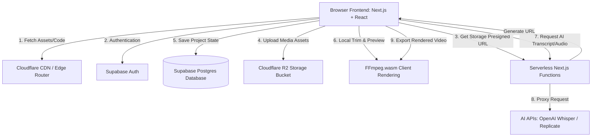

# Product Requirements Document (PRD)
## Project Name: SnapGen AI Video Editor
**Version:** 1.0.0  
**Author:** AI Pair Programmer (Antigravity)  
**Status:** Approved / Draft  

---

## 1. Executive Summary & Objectives

### 1.1. Product Vision
SnapGen is a web-based, AI-driven video editor designed to bring the capabilities of desktop-grade non-linear editors (e.g., Adobe Premiere Pro) directly into the browser. It combines multi-track timeline editing with powerful AI-assisted workflows (such as auto-transcription, smart captioning, voiceover generation, and background noise removal) to enable content creators, marketers, and social media managers to produce high-quality videos quickly and efficiently.

### 1.2. Strategic Goals
* **Accessibility:** No heavy desktop installation; runs directly in modern browsers using hardware acceleration.
* **Cost Efficiency & Scalability:** Scale to 100 concurrent active users with minimal server overhead by utilizing client-side WebAssembly rendering (`FFmpeg.wasm`) and CDN edge distributions.
* **Developer Excellence (gstack-aligned):** Adhere to the rigorous standard of testing (Playwright E2E), modular architecture, threat auditing, and automated CI/CD deployments.

---

## 2. Target Audience & User Personas

* **Sophia (Social Media Manager):** Needs to quickly trim video recordings, add auto-generated subtitles, apply brand overlays, and export optimized videos for TikTok and Instagram.
* **Marcus (Educator/Course Creator):** Records long lectures, needs to cut out silences automatically, clean up background noise, and export in 1080p with slide graphics overlay.
* **Leo (Marketing Specialist):** Generates product promotional clips, creates AI-synthesized voiceovers from scripts, and uses smart search to pull B-roll clips into the editor.

---

## 3. Functional Requirements

The application is split into four primary core modules: **Asset Management**, **Timeline Editor & Preview**, **AI Workflows**, and **Export Engine**.

### 3.1. Asset Management Module
* **Asset Upload:** Support drag-and-drop file upload for video (`.mp4`, `.mov`, `.webm`), audio (`.mp3`, `.wav`, `.m4a`), and graphics (`.png`, `.jpg`, `.svg`).
* **Storage Optimization:** Assets are uploaded directly from the browser to Cloudflare R2/S3 using presigned URLs to minimize server load.
* **Asset Library UI:** Categorized view of assets (Videos, Audios, Graphics) with hover previews, metadata displays (duration, dimensions, file size), and search/filtering capabilities.
* **Download Asset:** Ability to download raw uploaded source assets back to the client device.

### 3.2. Timeline Editor & Preview Player
* **Multi-Track Timeline:**
  * Dedicated tracks for Video, Audio, Graphics/Overlays, and Subtitles/Text.
  * Layering logic: Tracks positioned higher on the visual stack overlay tracks below them.
* **Timeline Operations:**
  * Drag-and-drop assets from library directly onto timeline tracks.
  * Frame-accurate scrubbing and playhead placement.
  * Clip splitting (Cut), trimming (adjusting start/end points), and deletion.
  * Ripple edit & snapping (clips snapping together to avoid blank gaps).
* **Interactive Preview Player:**
  * Real-time canvas-based rendering combining visual assets, overlays, and text based on playhead position.
  * Play, pause, seek, volume control, mute, and fullscreen options.
  * Switchable aspect ratios (16:9 widescreen, 9:16 vertical, 1:1 square).

### 3.3. AI-Powered Workflows (Serverless Async APIs)
* **Auto-Subtitles & Transcription:** Run uploaded audio/video tracks through Whisper API. Return timed transcript JSON to automatically populate the Subtitle track on the timeline.
* **AI Text-to-Speech (TTS):** Allow users to input text scripts, select voice models, and generate audio clips that append to the Audio track.
* **AI Background Noise Removal:** Process audio clips to isolate vocals and suppress ambient room noise.
* **Smart B-Roll Generator (Phase 2):** Analyze transcript segments to search and fetch free stock graphics/clips automatically.

### 3.4. Export & Rendering Engine
* **Client-Side Rendering (Primary):**
  * Utilize `FFmpeg.wasm` for local client-side compilation of timelines.
  * Compiles cuts, audio mixes, graphics overlays, and text subtitles directly in the user's browser, eliminating rendering queue server costs.
* **Export Configurations:**
  * **Resolutions:** 720p (HD), 1080p (Full HD), 4K (Ultra HD).
  * **Framerates:** 24, 30, 60 FPS.
  * **Presets:** Web-optimised (MP4/H.264), transparent overlays (WebM/VP9).
* **Render Progress UI:** Visual progress bar with estimated time remaining and cancel option.
* **Server-Side Render Queue (Fallback/High-End):**
  * For long, complex exports (>15 minutes) or low-powered devices, trigger an asynchronous serverless export using a containerized FFmpeg script running on AWS ECS/Fargate, storing the result in Cloudflare R2 and emailing/notifying the user.

---

## 4. Non-Functional Requirements & Scalability

To comfortably scale to 100+ concurrent active video editors while keeping operational costs extremely low, the application relies on a decentralized, client-heavy architecture.

| Parameter | Target Metric | Implementation Details |
|-----------|---------------|------------------------|
| **Target Scale** | 100 concurrent editors | Edge-routed static files, direct-to-storage uploads, client-side decoding/rendering. |
| **Initial Load Time (LCP)** | < 2.0 seconds | Next.js SSG + Cloudflare CDN cache, lazy-loaded heavy WebAssembly modules (`FFmpeg.wasm`). |
| **Scrubbing Frame Latency** | < 16ms (60 FPS) | HTML5 Canvas hardware acceleration, WebWorker for decoding metadata, optimized React state changes. |
| **Max Asset Upload Size** | 2 GB per file | Multi-part uploads directly to Cloudflare R2 storage bucket. |
| **Egress Cost** | $0.00 / GB | Leverages Cloudflare R2 storage which features zero-egress fees. |
| **Availability** | 99.9% uptime | Vercel Edge hosting + Supabase serverless database cluster. |

---

## 5. Technical Architecture & System Design

### 5.1. Technology Stack
* **Frontend Framework:** Next.js (App Router, React 19)
* **Styling System:** Vanilla CSS / CSS Modules (Premium dark layout, high-contrast timeline tracks, grid snapping indicators, glassmorphism panel backdrops).
* **State Management:** Zustand (optimized state management for fast playhead updates, scrubbing events, and timeline clip structures to avoid React re-render lags).
* **Database & Auth:** Supabase (Postgres for project schemas, metadata, real-time collab sync; Supabase Auth for session tokens).
* **Hosting:** Vercel (Frontend & Serverless API routing).
* **Storage:** Cloudflare R2 (Egress-free binary asset hosting).

---

## 6. Dev+Ops & Code Quality Rules (gstack Aligned)

We adopt the YC/gstack engineering framework to maintain institutional code quality, rigorous automated test gates, and secure deployment pipelines.

### 6.1. Code Quality Standard
* **Strict Typing:** TypeScript in strict mode (no `any` types allowed without explicit justification).
* **Linter & Formatting:** ESLint configured with strict React Hook checking, Prettier formatting executed automatically on pre-commit hooks.
* **Timeline State Mutability:** All updates to the timeline model must flow through dedicated, pure state-mutators inside Zustand. Direct mutation of clip properties is blocked.

### 6.2. Automated Testing Pipeline (QA)
* **Framework:** Playwright for End-to-End browser verification.
* **Coverage Scope:**
  * **Asset Upload Test:** Simulate dragging a `.mp4` file, verifying successful upload request and list rendering.
  * **Timeline Scrub Test:** Programmatically drag playhead, verify Canvas rendering engine updates frame.
  * **Export Engine Test:** Load dummy video/audio assets, run `FFmpeg.wasm` compile step, verify exported file length and integrity.
* **Pre-commit Gate:** All PRs must pass the test runner in headless Chromium environment before they can be merged.

### 6.3. Security Audits (CSO / STRIDE Model)
* **Spoofing / Tampering:** Row Level Security (RLS) enabled on Supabase Postgres. Users can only read/write project metadata belonging to their authenticated User ID.
* **Information Disclosure:** Asset downloads from Cloudflare R2 are secured using short-lived (15-minute expiration) signed URLs.
* **Elevation of Privilege:** Standard JWT verification in serverless endpoints. No administrative API keys exposed to the client.

### 6.4. CI/CD Release Pipeline (Ship)
* **GitHub Actions Workflow:**
  * On PR open: Run linter, build project, and run Playwright E2E suite.
  * On PR merge: Deploy to Vercel production branch, trigger post-deploy web vitals audit (`/canary` / `/benchmark` validation).

---

## 7. MVP Roadmap & Milestones

* **Milestone 1 (Foundation):** Multi-track timeline UI setup, Vanilla CSS styling, asset upload to Cloudflare R2, canvas-based preview player.
* **Milestone 2 (Editing Features):** Frame trimming, splitting, overlay layering, audio track mixing.
* **Milestone 3 (AI Integration):** OpenAI Whisper audio transcript to subtitle generation, TTS voiceovers.
* **Milestone 4 (Wasm Export):** Integration of `FFmpeg.wasm`, client-side compilation, progress monitoring.
* **Milestone 5 (QA & Deploy):** Playwright automated E2E tests, CI/CD pipeline, and public staging release.
